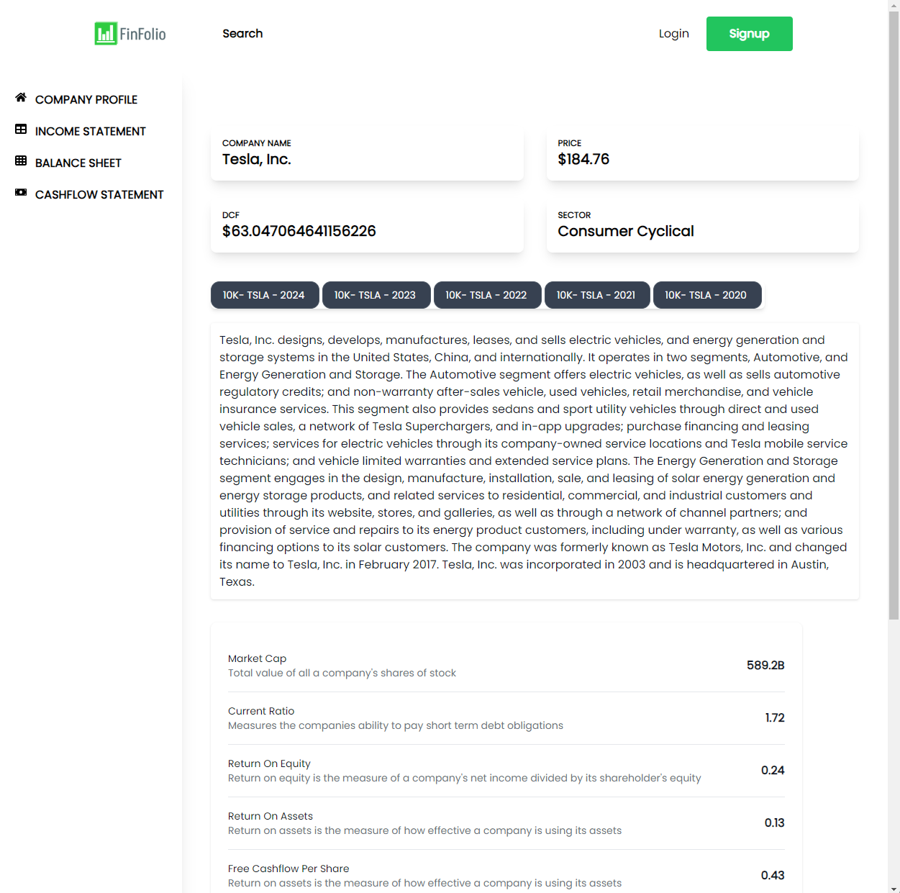

# FinFolio Vite + React + Tailwind CSS (Frontend)

Stock portfolio, allow user to view their favorite company profile, income statement, balance sheet, cashflow statement.

## Run Locally

Clone the project

```bash
  git clone https://github.com/vu-a-mai/xPortFinance-FrontEnd.git
```

Go to the project directory

```bash
    cd frontend
```

```bash
    npm install --save-dev vite
```

Run the project

```bash
    npm run dev
```

# Dependencies

```json
  "dependencies": {
    "@types/react-router": "^5.1.20",
    "@types/react-router-dom": "^5.3.3",
    "axios": "^1.6.8",
    "dotenv": "^16.4.5",
    "react": "^18.2.0",
    "react-dom": "^18.2.0",
    "react-icons": "^5.2.0",
    "react-router": "^6.23.0",
    "react-router-dom": "^6.23.0",
    "react-spinners": "^0.13.8",
    "uuid": "^9.0.1"
  },
  "devDependencies": {
    "@types/axios": "^0.14.0",
    "@types/node": "^20.12.7",
    "@types/react": "^18.2.66",
    "@types/react-dom": "^18.2.22",
    "@types/uuid": "^9.0.8",
    "@typescript-eslint/eslint-plugin": "^7.2.0",
    "@typescript-eslint/parser": "^7.2.0",
    "@vitejs/plugin-react": "^4.2.1",
    "autoprefixer": "^10.4.19",
    "eslint": "^8.57.0",
    "eslint-plugin-react-hooks": "^4.6.0",
    "eslint-plugin-react-refresh": "^0.4.6",
    "postcss": "^8.4.38",
    "tailwindcss": "^3.4.3",
    "typescript": "^5.2.2",
    "vite": "^5.2.0"
  }
```

## Screenshots




## 🛠 Tools

- Visual Studio Code

Visual Studio Code Extensions:

- ES7+ React/Redux-React-Native snippets
- Tailwind CSS IntelliSense

## 🔗 Links

[](https://www.linkedin.com/in/vu-anh-mai/)
